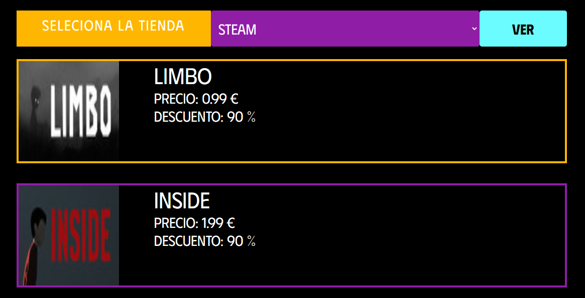

# Consumo de una api rest pública

En este proyecto se muestra el consumo de una Api Rest púbica utilizando JavaScript y Css para 
el apartado Visual

### Resultado

# [Probar aquí](https://esmeldy.github.io/ConsumoApi/)
